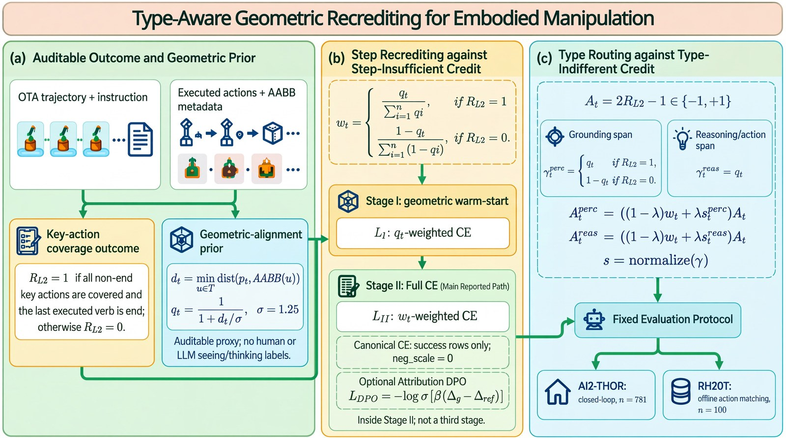
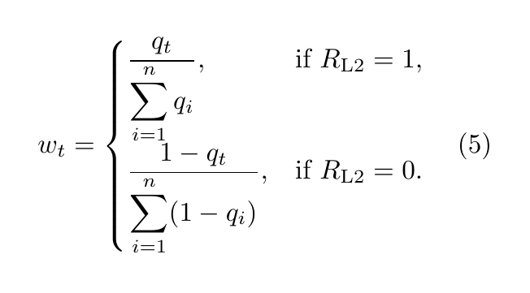
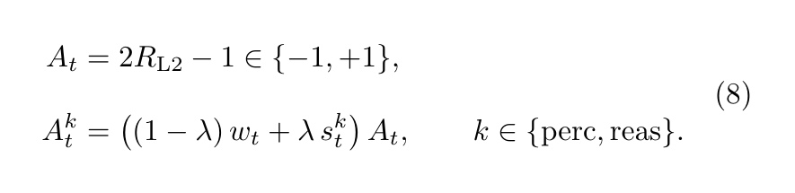
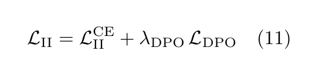
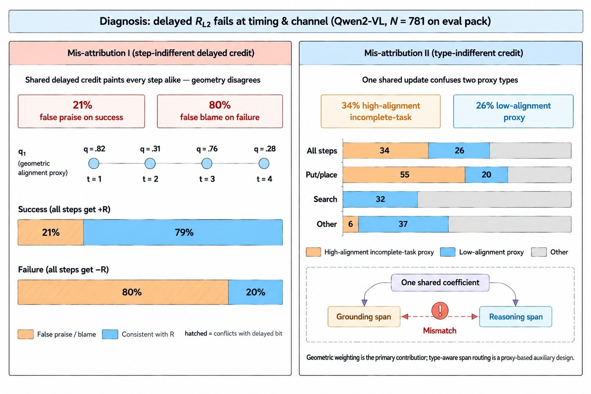
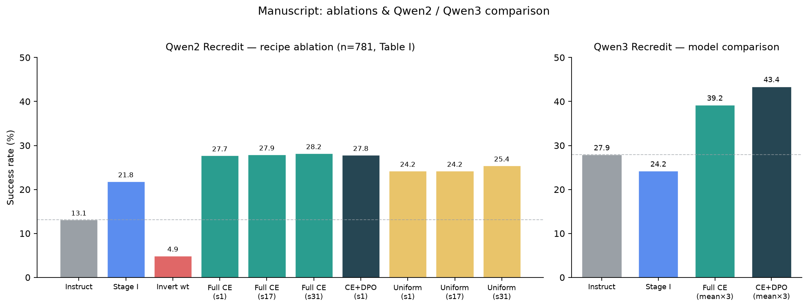
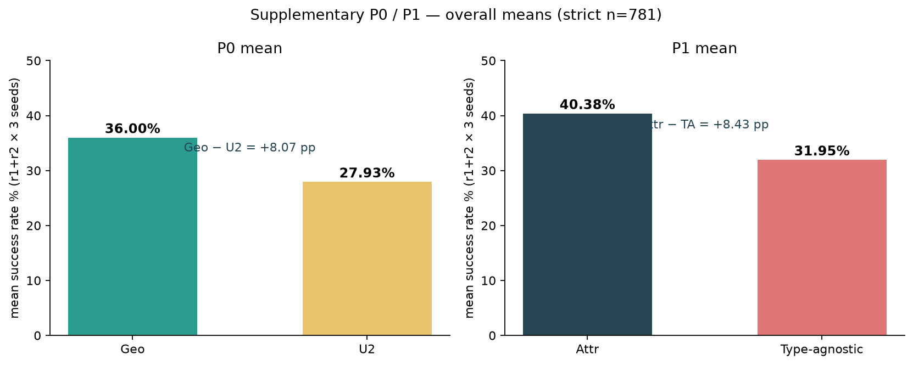
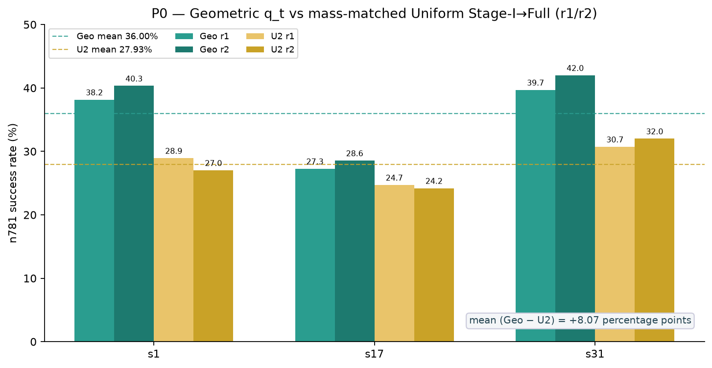
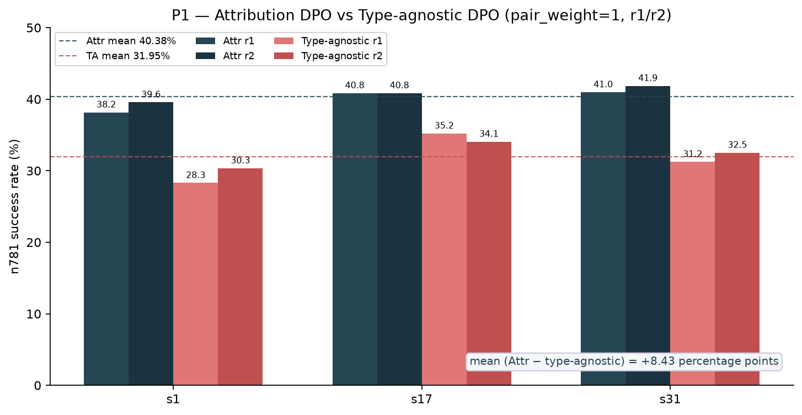

<div align="center">
<h1>
Seeing Wrong or Thinking Wrong?<br/>
Type-Aware Geometric Recrediting for Embodied Manipulation
</h1>
<p><b>Recredit</b> — auditable geometric credit assignment for embodied OTA traces</p>

<p>
<a href="https://huggingface.co/datasets/anony-recredit/recredit-r1-annotations"></a>
<a href="https://huggingface.co/anony-recredit/recredit-r1-ckpts"></a>
</p>


</div>

## Introduction

Vision-language models for embodied manipulation generate interleaved
observation–thought–action (OTA) trajectories. Common post-training recipes
still broadcast a delayed episode outcome uniformly across steps and channels,
which can **false-praise** off-target actions on successes and **false-blame**
geometrically correct contacts on failures—and cannot tell *seeing wrong* from
*thinking wrong*.

**Recredit** reassigns a delayed episode bit along both **time** (which step)
and **type** (grounding vs. reasoning). All signals are recomputed from
recorded actions and scene AABB metadata—**no** human seeing/thinking
failure labels.

| Symbol | Role |
|--------|------|
| `R_L2` ∈ {0,1} | Key-action coverage outcome: all required key actions present and trajectory ends with `end` |
| `q_t` ∈ (0,1] | Geometric alignment prior from action–target AABB distance (and discrete special cases) |
| `w_t` | Outcome-conditioned **spatial** weight (Eq. 5): emphasize high-`q_t` on success, low-`q_t` on failure; sum_t `w_t` = 1 |
| `A_t = 2 R_L2 − 1` | Trajectory-level sign ∈ {−1,+1}, constant across steps of one episode |
| `s_t^k`, `A_t^k` | Type scores / gated span coefficients for *k* ∈ {perc, reas} (Eqs. 7–8; auxiliary routing) |

**Spatial reweighting (Eq. 5)** — outcome-conditioned normalization of the geometric prior:



**Type-gated span coefficients (Eq. 8)** — interpolate spatial weights with type scores, then apply the trajectory sign:



On successes, `s_t^perc = s_t^reas = w_t`, so both span coefficients collapse to
`w_t`. Training follows a **two-stage** recipe (DPO is not a third stage):

1. **Stage I** — `q_t`-weighted imitation CE (Eq. 6), geometric warm-start
2. **Stage II** — `w_t`-weighted Full CE on success rows (Eq. 10), with
   **optional** attribution-mined DPO inside the same stage:





## Annotations & Checkpoints

This GitHub repository ships **code only**. Annotated packs and trained weights
are hosted on Hugging Face (anonymous account):

| Asset | URL |
|-------|-----|
| **Annotations** (recredit.v1 credit fields) | https://huggingface.co/datasets/anony-recredit/recredit-r1-annotations |
| **Checkpoints** (Stage I / Full CE / CE+DPO) | https://huggingface.co/anony-recredit/recredit-r1-ckpts |

```bash
# Dataset (annotations)
huggingface-cli download anony-recredit/recredit-r1-annotations \
  --repo-type dataset --local-dir ./data/recredit-r1-annotations

# Model checkpoints
huggingface-cli download anony-recredit/recredit-r1-ckpts \
  --local-dir ./ckpts/recredit-r1-ckpts
```

Point `${RECREDIT_ROOT}` at a local experiment root that contains (or symlinks)
these downloads before running training / eval scripts.

## Repository Contents

```text
assets/                # README images (+ assets/supp_p0_p1/ charts)
code/
  data_engine/         # R_L2 / q_t / w_t / A_t / e_t annotator
  train/               # Stage I / Stage II trainer recipe (verl-style)
  v28_pipeline/        # Stage-II pack / Attr-DPO pair build / n781 eval driver
  failctrl_v3_gr_mass_matched/   # failure-control GR training patches
  rh20t_eval/          # RH20T offline action-matching helpers
  supp_p0_p1/          # isolated supplementary P0/P1 control drivers
evaluation/rh20t/      # RH20T metrics / audits / six-variant runner
```

## Code overview

```bash
export RECREDIT_ROOT=/path/to/your/experiment/root
export EMBODIED_REASONER_ROOT=/path/to/embodied_reasoner_assets   # for data_engine
export RECREDIT_PYTHON=python
```

| Component | Role |
|-----------|------|
| `code/data_engine/` | Offline autofill of auditable credit fields from OTA + AABB metadata (**Eqs. 7–8** in `reward.py`) |
| `code/train/` | Parquet conversion + Stage I / Stage II **Eq. (10)** signed token-weighted CE |
| `code/v28_pipeline/` | Stage-II closerep packs, attribution DPO pair mining, n781 eval wrapper |
| `code/failctrl_v3_gr_mass_matched/` | Optional failure-control GR (unlikelihood; **not** Eq. 10) |
| `code/rh20t_eval/` + `evaluation/rh20t/` | Offline RH20T action-matching diagnostic tooling |
| `code/supp_p0_p1/` | Supplementary P0 (Geo↔mass-matched Uniform) and P1 (Attr↔type-agnostic DPO) |

---

## Paper results — ablations & Qwen2 / Qwen3

From the manuscript *Seeing Wrong or Thinking Wrong?* (Table I, Fig. 4,
Sec. VII–IX). Primary metric: held-out AI2-THOR closed-loop **n=781**.
Horizon bins use key-action length `n_ka`: Short `<4`,
Mid `4 ≤ n_ka ≤ 6`, Longer `>6`.



### Table I (overall SR%; Short / Mid / Longer in paper)

**Instruct floors**

| Backbone | SR | Short | Mid | Longer |
|----------|----|-------|-----|--------|
| Qwen2-VL-7B Instruct | 13.1 | 23.7 | 3.3 | 0.0 |
| Qwen2.5-VL-7B Instruct | 23.7 | 40.7 | 8.9 | 0.0 |
| Qwen3-VL-8B Instruct | 27.9 | 45.5 | 13.7 | 0.9 |

**Qwen2 Recredit — recipe ablation** (same Stage I → Stage II CE protocol;
arms differ only in the per-step credit map; Invert / Uniform are Qwen2-only
controls)

| Variant | SR | Short | Mid | Longer |
|---------|----|-------|-----|--------|
| Stage I | 21.8 | 30.1 | 18.1 | 1.8 |
| Invert `w_t` | 4.9 | 8.8 | 1.1 | 0.0 |
| Full CE (s1) | **27.7** | 37.9 | 21.8 | 6.1 |
| Full CE (s17) | 27.9 | 40.4 | 18.8 | 6.1 |
| Full CE (s31) | 28.2 | 38.6 | 23.6 | 2.6 |
| CE+DPO (s1) | 27.8 | 36.4 | 24.7 | 5.3 |
| Uniform (s1) | 24.2 | 31.8 | 21.4 | 4.4 |
| Uniform (s17) | 24.2 | 33.6 | 18.5 | 5.3 |
| Uniform (s31) | 25.4 | 33.6 | 22.9 | 2.6 |

**Qwen3 Recredit — independent model stack** (Full CE / CE+DPO = mean over 3 runs)

| Variant | SR | Short | Mid | Longer |
|---------|----|-------|-----|--------|
| Stage I | 24.2 | 39.4 | 12.2 | 0.0 |
| Full CE (mean×3) | **39.2** | 55.9 | 28.4 | 6.6 |
| CE+DPO (mean×3) | **43.4** | 63.4 | 29.9 | 6.1 |

### Ablation interpretation (from Sec. VII-B)

- **Qwen2 Full CE (s1)** = 216/781 = **27.66%** (**+14.6 pp** vs Qwen2 instruct).
- Locked-seed **CE+DPO (s1)** = 217/781 = **27.78%** — essentially tied with Full CE;
  no matched multi-seed DPO comparison in the MS.
- **Stage I** = 21.8%; **Uniform (s1)** = 24.2%; **Invert `w_t`** collapses to **4.9%**
  (credit map polarity matters).
- Matched retrain seeds: Full CE (s17/s31) mean **28.04%** vs Uniform (s17/s31)
  mean **24.78%** (**≈ +3.3 pp**). Gains are not monotonic across horizon bins;
  Longer remains hard on both stacks.
- **Qwen3** (same eval set, independent training stack): Full CE **39.2%**,
  CE+DPO **43.4%** (**+15.5 pp** vs Qwen3 instruct).

### Failure-aware routing (Table II, summary)

TYPE-NEG vs NEG-Uniform, matched within seed: mean SR **22.84%** vs **19.76%**
(**+3.08 pp**). Perception/reasoning routing is the only intentional difference;
inverting type at seed 1 yields 20.23% (below TYPE-NEG, above NEG-Uniform).

### Conclusion (Sec. IX, condensed)

Recredit derives step- and proxy-type-aware supervision from `R_L2` and
metadata geometric quality `q_t`, combining Stage I geometry-weighted CE with
Stage II outcome-conditioned CE and optional attribution DPO under a shared
protocol. On n=781, Qwen2 Full CE (s1) reaches **27.66%**; matched Full CE
(s17/s31) averages **28.04%** over Uniform **24.78%**. Independent Qwen3
reaches **39.2% / 43.4%** (Full / CE+DPO means). RH20T (n=100) improves verb
matching but object-conditioned pick/place remains limited. Overall: support for
**geometry-informed, non-uniform credit assignment** on short/mid horizons.

---

## Supplementary P0 / P1 (page-budget extensions)

The main manuscript already argues two claims that page limits leave only
partially stress-tested:

1. **Geometry (not mere reweighting mass) drives Stage-I credit.** Table I
   shows Full `w_t` beating Uniform / Invert, but a reader can still ask
   whether a Uniform Stage-I warm-start with the **same perc/reas+span token
   mass** would close the gap.
2. **Type-aware attribution (not “just DPO”) drives the preference term.**
   Locked-seed CE+DPO ≈ Full CE in Table I, so the paper needs a controlled
   contrast on *how* pairs are mined—attribution vs type-agnostic—under an
   identical DPO shell.

**P0** and **P1** are therefore released here as **supplementary controls**:
same held-out n=781 protocol and strict `metrics.success` scoring as the
paper, kept out of the main PDF for length, but intended to keep the story
**self-consistent**—they reinforce, rather than replace, Table I / Fig. 4.

Drivers: `code/supp_p0_p1/` · charts: `assets/supp_p0_p1/`.



### P0 — Geo `q_t` vs mass-matched Uniform Stage-I → Full

**Why:** closes the “Uniform with matched mass” loophole on claim (1). Stage-I→Full
recipe fixed; only the Stage-I credit map changes (geometric `q_t` vs
mass-matched Uniform / U2).

**Ties back to the paper:** if Geo still wins after mass matching, Table I’s
Full ≻ Uniform / Invert reading is about **geometry-informed assignment**, not
an artifact of how much weight mass sits on perc vs reas spans.



| Seed | Rep | Geo % | U2 % | Geo − U2 (pp) |
|------|-----|-------|------|---------------|
| s1 | r1 | 38.16 | 28.94 | +9.22 |
| s1 | r2 | 40.33 | 27.02 | +13.32 |
| s17 | r1 | 27.27 | 24.71 | +2.56 |
| s17 | r2 | 28.55 | 24.20 | +4.35 |
| s31 | r1 | 39.69 | 30.73 | +8.96 |
| s31 | r2 | 42.00 | 32.01 | +9.99 |
| **mean** | r1+r2 | **36.00** | **27.93** | **+8.07** |

**Result:** Geo wins every seed×rep. Mean success-rate difference
**Geo − U2 = +8.07 percentage points**. Strengthens the paper’s
geometry-informed credit claim under a stricter Uniform control.

**Code map (`code/supp_p0_p1/`)**

| Step | Script |
|------|--------|
| Build U2 mass-matched Stage-I parquet | `build_mass_matched_uniform_stage1_parquet.py`, `rebuild_u2_parquet.sh` |
| Stage I / Full train | `run_p0_stage1.sh`, `run_p0_stage2_full.sh`, `run_p0_all_seeds.sh` |
| n781 eval × reps | `run_p0_eval_n781.sh`, `run_p0_eval_x3.sh`, `run_p0_eval_all.sh` |
| Strict rescore | `score_n781_strict.py` |
| Aggregate / sign-flip | `run_p0_aggregate_stats.sh`, `stats_scene_cluster_signflip.py` |

### P1 — Attribution DPO vs type-agnostic DPO

**Why:** closes the “any preference objective would do” loophole on claim (2).
Same `pair_weight=1` DPO shell; only pair construction changes (type-aware
attribution mining vs type-agnostic).

**Ties back to the paper:** Table I’s near-tie CE+DPO≈Full on one seed does
**not** imply attribution is inert—it implies you need a matched contrast on
preference *direction*. P1 supplies that contrast and aligns with the
type-aware theme (seeing vs thinking) already used in failure routing
(Table II).



| Seed | Rep | Attr % | Type-agnostic % | Attr − TA (pp) |
|------|-----|--------|-----------------|----------------|
| s1 | r1 | 38.16 | 28.30 | +9.86 |
| s1 | r2 | 39.56 | 30.35 | +9.22 |
| s17 | r1 | 40.85 | 35.21 | +5.63 |
| s17 | r2 | 40.85 | 34.06 | +6.79 |
| s31 | r1 | 40.97 | 31.24 | +9.73 |
| s31 | r2 | 41.87 | 32.52 | +9.35 |
| **mean** | r1+r2 | **40.38** | **31.95** | **+8.43** |

**Result:** Attr wins every seed×rep. Mean success-rate difference
**Attr − type-agnostic = +8.43 percentage points**. Strengthens the claim
that **type-aware preference direction** matters beyond running DPO alone.

**Code map (`code/supp_p0_p1/`)**

| Step | Script |
|------|--------|
| Pair build / audit | `p1_pairs.py`, `build_p1_pairs.py`, `build_p1_pair_data.sh`, `audit_p1_pairs.py` |
| Prepare + DPO train | `prepare_p1_all.sh`, `run_p1_dpo.sh`, `run_p1_all.sh` |
| n781 eval | `run_p1_eval_n781.sh`, `run_p1_eval_all.sh`, `run_p1_resume_eval.sh` |


## Citation

```bibtex
@inproceedings{recredit2026,
  title     = {Seeing Wrong or Thinking Wrong? Type-Aware Geometric Recrediting for Embodied Manipulation},
  author    = {Anonymous Authors},
  booktitle = {Under double-blind review},
  year      = {2026}
}
```

## Acknowledgment

We thank the Embodied-Reasoner authors for releasing open OTA trajectories.
Generative AI tools were used solely for figure refinement and basic formatting
checks; the authors take full responsibility for all content.
