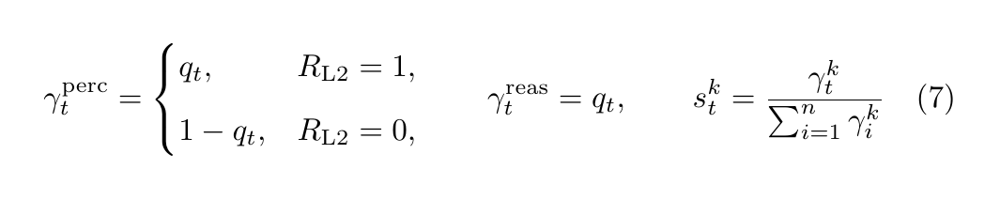

# Recredit-R1 data engine (autofill)

Convert Embodied-Reasoner multiturn OTA JSON into `recredit.v1` records with
rule-derived credit fields (`R_L2`, `q_t`, `w_t`, and type proxies).  
**No** human seeing/thinking failure labels are required.

## Paper-faithful coefficients (Eqs. 5 → 7–8 → 10)

### Spatial weights (Eq. 5)


| Symbol | Role | Code |
|--------|------|------|
| `R_L2` ∈ {0,1} | Key-action coverage outcome | `compute_R_L2` |
| `q_t` | AABB geometric alignment prior | geometry / autofill |
| `w_t` | Outcome-conditioned spatial weight (sums to 1) | `spatial_weights` |

### Type scores (Eq. 7)



| Symbol | Role | Code |
|--------|------|------|
| `γ_t^k` | Raw type proxy (`perc` / `reas`) | inside `type_scores` |
| `s_t^k` | Trajectory-normalized type scores | `type_scores` |

### Gated span coefficients (Eq. 8)


| Symbol | Role | Code |
|--------|------|------|
| `A_t = 2 R_L2 − 1` | Trajectory sign ∈ {−1,+1} | `paper_eq8_coefficients` |
| `A_t^k` | Gated signed span coefficient | `gated_advantages` |

### Stage II CE objective (Eq. 10)

Used by the trainer; coefficients are written into parquet by this data engine:


Canonical helper: `paper_eq8_coefficients` in `reward.py`.  
Tests: `python test_eq8_eq10.py`.

> **Note:** `code/failctrl_v3_gr_mass_matched/` is an *optional* failure-aware
> unlikelihood protocol (η / mass-matched). It is **not** Eq. (10).

```bash
export EMBODIED_REASONER_ROOT=/path/to/embodied_reasoner_assets
export ER_ROOT="$EMBODIED_REASONER_ROOT"
MODE=local ./scripts/run_autofill.sh
```

Acceptance: validation report `ok: true` and `n_errors: 0`.
