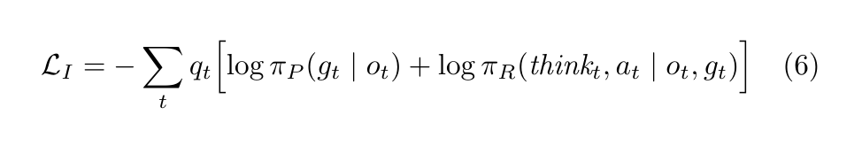
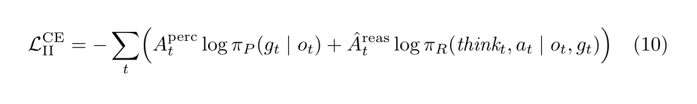
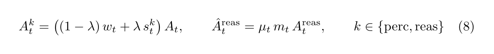

# Recredit-R1 training recipe (verl-style)

Two-stage training from the paper, implemented as a verl FSDP recipe.

Backbone: **Qwen2.5-VL-7B-Instruct** (VLM required for RGB OTA).  
Framework: [verl-project/verl](https://github.com/verl-project/verl) `v0.4.1`.

## Stage I — geometric warm-start (Eq. 6)

Paper objective:



| | |
|--|--|
| **What it does** | `q_t`-weighted imitation on short/mid-horizon clips |
| **Implementation** | Token-weighted SFT: every response token is scaled by step prior `q_t` |
| **Script** | `run_stage1.sh` |

## Stage II — outcome-guided recrediting CE (Eq. 10)

Paper objective:



Span coefficients (Eq. 8) and optional discourse gate on the reasoning/action span:



| | |
|--|--|
| **What it does** | Apply gated signed coefficients from `data_engine` as token weights |
| **Implementation** | Same trainer as Stage I. Grounding span × `A_t_perc`; thought+action span × `A_hat_reas = μ_t · m_t · A_t_reas`. Coefficients come from `data_engine.reward.gated_advantages` / `paper_eq8_coefficients` (Eq. 8). Canonical Full CE uses success rows only (`neg_scale=0`), where `A_t_perc = A_t_reas = w_t`. |
| **Script** | `run_stage2.sh` |

Optional attribution DPO is stacked **inside** Stage II (Eq. 11), not a third stage — see repo-root README.

## Suggested layout

```
${RECREDIT_ROOT}/
  miniconda3/          env `recredit`
  code/verl/           cloned framework
  code/recredit_r1/    this recipe
  models/Qwen2.5-VL-7B-Instruct/
  data/raw/            unpacked recredit.v1 pack (JSON + RGB)
  data/parquet/        trainer-format rows
  ckpts/stage1|stage2/
```

## Commands

```bash
# 1) framework + deps + model
bash code/train/setup_remote.sh

# 2) unpack pack + parquet
bash code/train/prepare_data.sh /path/to/pack.tar.gz

# 3) Stage I then Stage II (set NPROC to your GPU count)
bash code/train/run_stage1.sh
bash code/train/run_stage2.sh
```

Floorplans are held out by scene for val. Stage I keeps short/mid-horizon clips (`max-horizon=8`).
